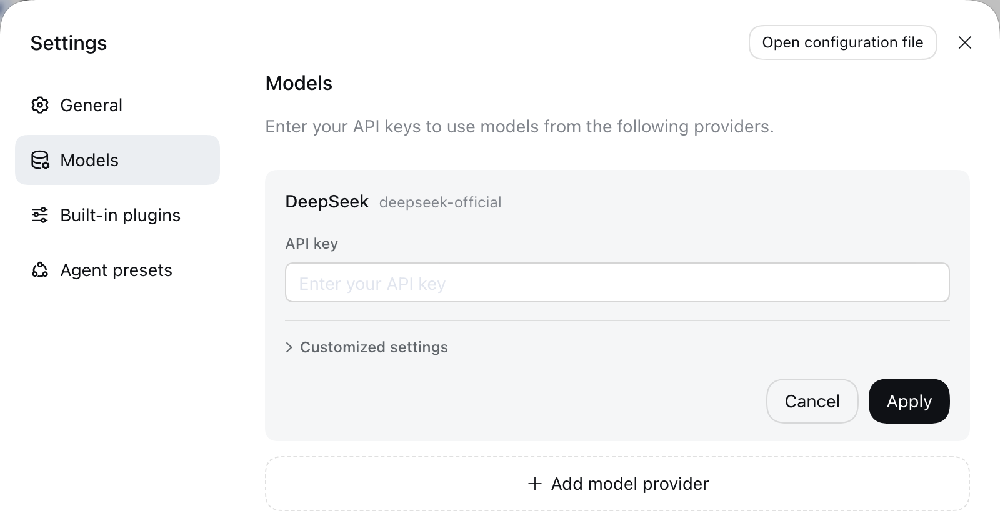
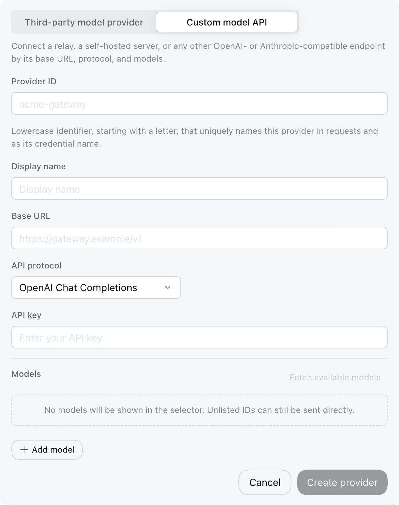

# Configure models

English | [中文](providers.zh.md)

This guide assumes you started the Web UI through the [root README](../../../README.md#run). Model changes take effect on the next request without restarting the server.

## Configure DeepSeek

Open **Settings → Models**. The DeepSeek card exposes one API-key field; enter the key and save it.



Keys are write-only. The page receives a redacted descriptor after saving, never the literal secret. The key is stored in `$DSH_HOME/.credentials.yaml`, while settings retain only its credential reference.

## Add a third-party provider

Choose **Add model provider**. The card opens on **Third-party model provider**: pick a provider dsh ships with — the list shows provider ids such as `anthropic`, `openai`, `moonshotai` for Kimi, or `zai` for GLM — enter its API key, and save. The installed catalog supplies the endpoint, protocol, and model list.

Providers that sign in with OAuth, such as Codex, are not supported here yet.

## Add a custom model API

Switch the card to **Custom model API** for a relay, a company gateway, a self-hosted server, or any provider absent from the installed catalog. Supply a lowercase Provider ID, base URL, API protocol, credential, and at least one model. The **API protocol** must be the one your gateway speaks, and the picker offers three: OpenAI Chat Completions, OpenAI Responses, and Anthropic Messages, stored in the active profile's `cordis.patch.yml` as `openai-completions`, `openai-responses`, and `anthropic-messages`. A provider speaks one protocol, so a gateway that serves two needs two providers.



The Provider ID is permanent because requests, saved sessions, model defaults, and credential references use it. To rename a provider, add a new provider and delete the old one. The display name, base URL, protocol, credential, and models remain editable.

### Discover models

Under **Model catalog**, choose **Fetch available models** to ask the endpoint which models it serves. The request uses the base URL, protocol, and key currently in the form, or a saved provider's stored key, and the reply opens a searchable picker: search, tick the models you want, and choose **Add selected**. Nothing is stored until you save or create the provider.

Discovery reads the listing formats common gateways publish, but not every endpoint answers in one of them, so treat it as a convenience rather than a guarantee: when it fails or lists nothing, add the model ids by hand and they work just the same. A built-in provider is always answered from the installed catalog, even when its base URL points at a gateway, so fetch through a custom provider to see what the gateway really serves.

## Add a self-hosted (heavy) provider

A heavy provider is a self-hosted service or a vendor-direct route the harness manages end to end: it is listed in the add-provider picker, installs nothing until you add it, then detects or installs its endpoint on this device, probes its health, writes the route and its model list, and removes the local install with the route when you ask. Three ship today: **FreeLLMAPI**, **Antigravity Proxy**, and **Command Code**.

Open **Settings → Models** and choose **Add model provider**; the picker's **Self-hosted / heavy** group lists the heavy cards (search finds them too). A card that is not configured reads **Listed — add to configure**, and once its route exists the provider appears in the provider list's own **Self-hosted / heavy** group with a health dot and its dashboard links.

The card's form shows the provider's summary, a health badge with **Check now**, its quirks, and the add modes. **Use a detected instance** reuses a service already running on this device — detection tries the address the route recorded, then the declared endpoint, then the default loopback port — and **Install locally** runs the manifest's install steps on the host (Docker, Podman, or Node, whichever the provider declares) with step-by-step progress. The install job runs on the host and survives closing the page: reopen the provider to reattach. A unified-key provider also shows an optional **Unified key** field; the key is stored like any other provider credential, while Antigravity needs no client key and says so instead of asking for one. The route is written only after all required steps succeed, so a failed install leaves no route or credential behind; the add stores the endpoint's model listing, or the manifest's fallback model when the endpoint lists nothing. Removing a heavy provider from the provider list opens a dialog that lists everything removal will do and offers **Also remove the local install and its data**.

### Point a service provider at a custom instance

In **Use a detected instance** mode, a service provider (Antigravity Proxy or FreeLLMAPI) offers a **Custom instance URL (optional)** field. Leave it empty to keep detection and the declared loopback endpoint; type an address when the instance runs somewhere detection cannot reach — another port on this machine, or another machine on your Tailscale network or LAN. The address must be an absolute `http` or `https` URL without embedded credentials, a query, or a fragment; trailing slashes are dropped. The route is written at that address and the provider's health path is probed there. An address that does not answer is still saved — the health badge reports **Unreachable** until it does, instead of blocking the add. A non-loopback address makes the route reach beyond this machine, so keep it on a trusted network. **Command Code** is a vendor-direct route and offers no custom-instance field.

### Antigravity Proxy

**Antigravity Proxy** is an Anthropic-compatible proxy in front of one or more Google Antigravity OAuth accounts. On Linux and macOS the harness installs the `antigravity-claude-proxy` npm package under `~/.local` (Node.js 18 or newer; Docker is never needed) and keeps it running as a user service: a systemd unit named `antigravity-proxy.service` on Linux, a launchd agent named `dev.enpoi.antigravity-proxy` on macOS. Windows has no supported local install; install the package yourself or point the route at a proxy running elsewhere.

The proxy answers the Anthropic Messages protocol at `http://127.0.0.1:8082` and its health check is `GET /health`. The proxy needs no client key, but the route stores a placeholder credential reference because the Anthropic protocol requires one. Do not add DSH key-pool identities to this route: the proxy runs its own sticky account pool with cooldowns, so the route must keep DSH pooling off. Add Google accounts in the proxy's console at `http://127.0.0.1:8082`; the console has no password, so treat it as trusted-network-only. Adding an account opens a browser OAuth flow that waits on a localhost callback, so on a headless host the printed URL must be opened on a machine that can reach that callback. Quotas are weekly windows per account and model, and `RESOURCE_EXHAUSTED … resets after 46h` is what a spent account normally reports.

**Share it with another local tool.** Any tool that speaks Anthropic Messages can use the installed proxy by pointing at `http://127.0.0.1:8082` with any placeholder key. It keeps running as the user service installed with it, and it keeps the account pool configured in the console.

**Reach it from another device.** The installed service pins `HOST=127.0.0.1`, so only this machine can reach it as installed. To serve another device over Tailscale or the LAN, change `HOST` in the unit (or the launchd plist) and reload the service, then point that device's tool at this machine's address. Never expose the proxy beyond a trusted private network: it has no authentication and it holds your Google account tokens.

**Use it from another harness machine.** On the other machine, add Antigravity Proxy with **Use a detected instance** and type this machine's address (for example `http://<host>:8082`) in **Custom instance URL (optional)**. The route is written at that address and `/health` is probed there, so the other machine's badge and route agree with the service here.

**Removal.** Removing the provider asks whether to also remove the local install. With that box ticked, the teardown stops and disables the user service, deletes the unit or plist, uninstalls the package from `~/.local` (and from any version-manager prefix an earlier setup used), and deletes `~/.config/antigravity-proxy`, which holds every Google OAuth token and the usage history. Service logs under `~/Library/Logs` on macOS are left in place. Other tools — including other harness machines pointed at this proxy — stop working, and a dotfiles repository that manages the unit file can restore it on its next sync. Without the box, removal drops only DSH-side state — the route, its stored credential, pool state, cache entry, and chain links — while the service keeps running.

### FreeLLMAPI

**FreeLLMAPI** is a self-hosted gateway that puts the free tiers of about thirty providers behind one OpenAI-compatible endpoint at `http://127.0.0.1:3002/v1`, health `GET /api/ping`, dashboard at `http://127.0.0.1:3002`. On Linux, and on any platform without a declared desktop variant, the harness clones the project to `~/freellmapi` and starts it with Docker or Podman Compose. macOS and Windows install the vendor desktop app instead and pin it to port 3002, with data in `~/Library/Application Support/FreeLLMAPI` and `%APPDATA%\FreeLLMAPI`; the Windows steps run through bash, so install Git for Windows first.

The install writes `~/freellmapi/.env` with a generated `ENCRYPTION_KEY`, `PORT=3002`, and `HOST_BIND=127.0.0.1`, keeps an existing non-empty key on a re-run, and refuses to wipe a directory that holds a `.env` but no `.git`. That key encrypts every upstream provider key stored in the dashboard, and the compose volume holds the unified key: losing the `.env` or deleting the volume makes those keys unrecoverable. The first-run setup code and the password-reset code appear only in `docker compose logs`, while upstream provider keys are added in the web dashboard. The unified key is the only client authentication the gateway checks, so never expose its port beyond the local machine.

The free-tier model catalog is a monthly snapshot, so `/v1/models` can list models that no configured key actually serves.

**Removal.** With the local-uninstall box ticked, the teardown stops the stack and deletes its data volume (`docker compose down -v`), removes the container image, deletes `~/freellmapi`, and clears the desktop app, its data directory, and the downloaded installer on macOS and Windows. The volume holds every upstream key and the unified key, so tick the box only when that data is expendable; without it, removal drops only DSH-side state.

### Command Code

**Command Code** is a vendor-direct route: no service runs on this machine. Adding it runs one setup step that links and builds the `dsh-enpoi-commandcode-provider` package inside the profile (Node.js 22), then writes the route at `https://api.commandcode.ai`, which DSH speaks through that package's adapter. The vendor refuses generic HTTP clients ("Proxy use detected"), but the package injects the Command Code CLI identity headers itself, so no proxy is required and the legacy `:8899` keypool proxy is not involved.

The route starts with one key identity (`COMMANDCODE_KEY_1`). Manage keys on the **Keys** card of the provider's detail panel: identities rotate in priority order by default, each keeps its own quota and cooldown state, and a key can be tested or its cooldown reset from that card. A `QUOTA` failure appears only when every pooled identity is spent, which is a normal weekly state rather than a routing fault. Only keys stored under the shipped reference are removed with the provider; keys added under other identities stay on the card, and vendor account state and quota live at commandcode.ai and are never touched by removal.

If you used the legacy keypool proxy at `:8899`, migrate instead of re-entering keys: from the profile root run `node packages/enpoi-commandcode-provider/scripts/import-keypool-keys.mjs`. It reads `~/.config/opencode/keypool/pools.json` (or a path given with `--pools`), prints the `pool:` block to place in the route's settings YAML and which key belongs to which identity on the Keys card, and never prints key material. A route still pointed at a loopback keypool keeps working until you switch it: set its base URL to `https://api.commandcode.ai`, add the imported identities, then retire the proxy.

The route's model list comes from the provider package's bundled catalog snapshot — capabilities, context windows, plan badges, and reasoning efforts included — which the direct vendor route resolves without a network call or a `/models` request.

## Select a model

Configured providers appear in the model picker. Selecting a model also makes it the default for new sessions. A session that has already sent a request retains the model recorded in its own log.

If a saved default names a provider that was deleted, the composer displays **Select model** and blocks input until another model is selected.

## Advanced configuration

The generated [plugin configuration catalog](../../config-catalog.md) lists every supported field and default for every plugin; [`dsh-llm-pi-ai`](../../config-catalog.md#deepseek-aidsh-llm-pi-ai) is the provider section this page configures. The [`dsh-llm-pi-ai`](../../../packages/llm/llm-pi-ai/README.md) and [`dsh-llm-deepseek`](../../../packages/llm/llm-deepseek/README.md) references own direct `cordis.patch.yml` configuration, catalog resolution, reasoning controls, credentials, and adapter errors.

::: tip Additional settings
The Models page exposes the API key, display name, base URL, API protocol, and each model's id, display name, context window, max output tokens, and input types. Configure reasoning effort levels, request-compatibility switches, headers, timeouts, and retry policy in `$DSH_HOME/profiles/<profile>/cordis.patch.yml`, the same document the page writes. Edit it directly, or, when the browser runs on the same machine as the server, open it with **Open configuration file** in the Settings header; the adapters re-read it on the next request, so nothing needs a restart. The subsections below cover the fields most gateways need.

For the standard Web UI launch with `dsh web`, `<profile>` is `web`, so the path is `$DSH_HOME/profiles/web/cordis.patch.yml`. If you launch a custom profile, use the name selected at startup instead.
:::

### Image input

In **Settings → Models**, edit the provider, open **Customized settings**, and expand the model's **Model options**. **Input types** occupies its own row below the capacity fields. Select **Image** for a model that accepts images, and save. **Text** starts selected for a new custom model with no inherited image capability. At least one type must remain selected; select Image before clearing Text for an image-only model.

The checkboxes save `input` for pi-ai models and `inputModalities` for the direct DeepSeek adapter. You can also edit the model in `$DSH_HOME/profiles/<profile>/cordis.patch.yml`; for example, this custom pi-ai provider declares one text-only model and one vision model:

These examples show config fields inside a profile patch. A Cordis config override replaces the complete entry config; preserve other providers and fields when editing an existing override.

```yaml
- id: llm-pi-ai
  config:
    providers:
      my-gateway:
        apiKeyEnv: GATEWAY_API_KEY
        api: openai-completions
        baseURL: https://gateway.example/v1
        models:
          - id: legacy-chat
          - id: vision-preview
            input: [text, image]
```

Pi-ai's `input` accepts `text` and `image` and applies to that model alone. An explicit nonempty selection takes priority. An omitted or empty `input` inherits the installed catalog's input types, then the route's `defaultInput`, which defaults to `[text]`. The checkboxes display these inherited values without saving an override when you merely open the row.

DeepSeek treats an omitted `inputModalities` as text-only and rejects an empty list. Clearing Image also removes that model's `imagePixelBudget` and `imageMaxBytes`, because DeepSeek rejects image limits on a text-only model. Set those limits again if you later enable images and need custom limits.

To restore inheritance after editing the checkboxes, remove the model's `input` or `inputModalities` field from `cordis.patch.yml`. **Restore defaults** removes the entire model-catalog override, including other model edits, so use it only when you want to restore the whole catalog.

If every model you entered by hand takes images, set the fallback once on the route instead of on each of them:

```yaml
- id: llm-pi-ai
  config:
    providers:
      vision-gateway:
        apiKeyEnv: GATEWAY_API_KEY
        api: openai-completions
        baseURL: https://vision.example/v1
        defaultInput: [text, image]
        models:
          - id: first-model
          - id: second-model
```

`defaultInput` is a fallback, not an override, and defaults to `[text]`: on a built-in provider it answers only for models its catalog does not describe, so it never removes images from a catalog model that has them. Narrow one of those with that model's own `input`. When a built-in provider has no explicit `models` list, write it under `modelOverrides`, keyed by model id:

```yaml
- id: llm-pi-ai
  config:
    providers:
      anthropic:
        modelOverrides:
          claude-sonnet-4-5:
            input: [text]
```

In pi-ai configuration, every list must name at least one modality except a model's own `input`, where an empty list means the same as omitting it. An unknown modality is refused wherever it is written.

Both fields state a claim about your endpoint rather than checking it. A model that declares images its endpoint does not serve is not caught here; the provider rejects the request instead.

### Reasoning effort

The model picker offers an **Effort** menu for a model that declares reasoning levels. A built-in provider's models inherit their levels from the installed catalog. A model you enter by hand declares none, so the Effort entry does not appear in the menu and the endpoint's own default decides whether the model thinks. Declare the levels with `reasoningEfforts` in `$DSH_HOME/profiles/<profile>/cordis.patch.yml`:

```yaml
- id: llm-pi-ai
  config:
    providers:
      my-gateway:
        apiKeyEnv: GATEWAY_API_KEY
        api: openai-completions
        baseURL: https://gateway.example/v1
        reasoning: high
        models:
          - id: my-reasoner
            reasoningEfforts:
              off:
              high: high
              max: max
```

Each key is a level the menu offers, and its value is the spelling sent on the wire as `reasoning_effort`, so `max: xhigh` renames a level for a gateway with its own vocabulary. Only `off` may stay empty, because for most endpoints not thinking is the parameter's absence. The route's `reasoning` is the level used while a session has picked none; choosing an effort in the picker saves it, with the model, as the default for new sessions.

An `off` left empty sends nothing, which only stops a model that thinks on request; an `off` given a value sends that value as `reasoning_effort` instead. A model that thinks unless told not to — DeepSeek V4 behind an OpenAI-compatible gateway, for example — needs `compat.thinkingFormat: deepseek`, which makes `off` send `thinking: {type: disabled}` and every other level send `thinking: {type: enabled}` beside the effort:

```yaml
        models:
          - id: deepseek-v4-pro
            compat:
              thinkingFormat: deepseek
            reasoningEfforts:
              off:
              high: high
              max: max
```

A built-in provider's model whose gateway does not reason loses its levels with `reasoningEfforts: false` under `modelOverrides`; selecting an effort for it is then refused as `UNSUPPORTED_REASONING_EFFORT`. DeepSeek's own route needs none of this: its models already offer `off`, `low`, `high`, and `max`, and `llm-deepseek.reasoningEffort` sets the default the picker starts from:

```yaml
- id: llm-deepseek
  config:
    reasoningEffort: max
```

### Request compatibility

A gateway can hold a working key at a reachable address and still refuse every request. pi-ai decides the shape of a request — which role carries the system prompt, which field caps the output, how a thinking level travels — from the endpoint's URL, and an address it does not recognize is addressed as though it were OpenAI itself. Most OpenAI-compatible gateways refuse at least one thing OpenAI accepts.

Two account for most of it. A model that declares reasoning has its system prompt sent as `role: "developer"`, which many gateways reject outright, and the output cap is sent as `max_completion_tokens`, which a server that only knows `max_tokens` refuses. The form has no field for either; correct them on the route in `$DSH_HOME/profiles/<profile>/cordis.patch.yml`:

```yaml
- id: llm-pi-ai
  config:
    providers:
      my-gateway:
        apiKeyEnv: GATEWAY_API_KEY
        api: openai-completions
        baseURL: https://gateway.example/v1
        compat:
          supportsDeveloperRole: false
          maxTokensField: max_tokens
        models:
          - id: my-model
```

A route's `compat` is the default for its models, and a model's own wins field by field, so one model can be corrected without restating the route:

```yaml
        models:
          - id: my-model
          - id: my-reasoner
            compat:
              thinkingFormat: deepseek
```

What neither sets keeps the installed catalog's value for that model, and what the catalog does not describe falls to pi-ai's detection. Give every switch you name a value: a key left empty (`supportsDeveloperRole:`) is refused rather than ignored, because an empty value would erase what the catalog knows while saying nothing in its place. A name no protocol accepts is refused too, and the message lists the ones that are available.

Each switch belongs to the protocols that declare it, so a switch valid on one `api` may be refused on another — the message names what that protocol does offer. Like `input` above, a switch states a claim about your endpoint rather than checking it: setting one your gateway does not actually need simply sends a different request.

Every switch, its accepted values, and the protocols that take it are listed under `PiAiCompatProfile` in the [generated `dsh-llm-pi-ai` configuration reference](../../config-catalog.md#deepseek-aidsh-llm-pi-ai) — which is derived from the source, so it cannot fall behind what the adapter accepts.

## Troubleshooting

- **`MISSING_CREDENTIAL`** — Store the provider key through the Models page or supply the referenced environment variable.
- **`UNKNOWN_MODEL`** — Select a configured model or add the missing model to the custom provider.
- **Fetching available models returns 401** — Check the key. Model discovery calls the OpenAI-compatible `GET /models` endpoint; enter models manually for endpoints that do not provide it.
- **Fetching available models reports neither a `data` array nor a `models` object** — The endpoint's listing is in a format discovery does not read. Enter the models by hand.
- **The gateway refuses every request although the key and URL are right** — Its request shape differs from OpenAI's. Start with `compat.supportsDeveloperRole: false` and `compat.maxTokensField: max_tokens` on the route.
- **Only reasoning models fail** — pi-ai sends their system prompt as the `developer` role, which the gateway rejects. Set `compat.supportsDeveloperRole: false`.
- **The Effort menu does not appear for a model you entered by hand** — It declares no levels. Add `reasoningEfforts` to the model in `cordis.patch.yml`.
- **`off` does not stop a DeepSeek model from thinking** — An empty `off` sends no reasoning field at all, and an endpoint that thinks by default keeps thinking. Set `compat.thinkingFormat: deepseek` on the model or the route.
- **A compat switch is refused as having no value** — A key written with nothing after the colon. Give it a value, or remove the key to keep the installed catalog's.
- **An image is refused before sending** — The model declares no image modality. Give a custom provider's model `input: [text, image]`; on DeepSeek's own route, select an image-capable entry from the configured catalog (`deepseek-flash` by default) and confirm that your gateway serves that model with image input.
- **The provider rejects a request carrying an image** — The model declares images its endpoint does not actually serve. Remove `image` from whichever list granted it — the model's `input`, or the route's `defaultInput` — then start a new session: the attached image stays in the session log, so the same request repeats until the session moves off it.
- **A heavy provider's health badge reads Unreachable** — The route was still written. Start the service (or correct, or clear, the **Custom instance URL**) and choose **Check now**; an unreachable instance never blocks the add.
- **A heavy install failed** — No route and no credential were stored. The form shows the failing step's log tail; fix the reported dependency and retry.
- **A heavy provider says it is available after the next restart** — Its settings namespace is not mounted in the running profile. Build the profile and restart the harness, then add the provider.
- **Command Code reports `QUOTA`** — Every pooled key is spent for its window. Add or enable a key on the Keys card, or wait for the reset the error names.
- **Antigravity account sign-in needs a browser** — The OAuth flow waits on a localhost callback. On a headless host, open the printed URL from a machine that can reach that callback.
