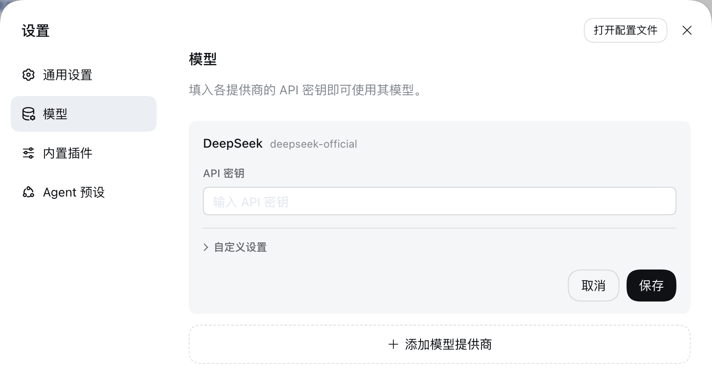
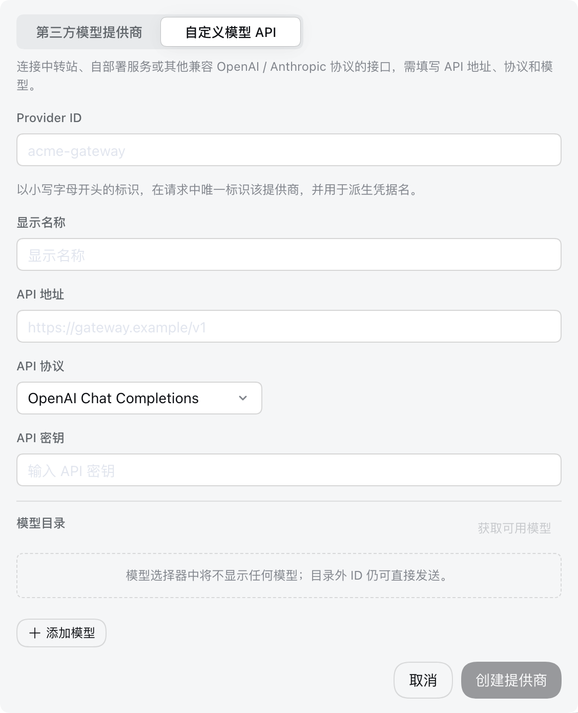

# 配置模型

[English](providers.md) | 中文

本指南假定你已按照[根 README](../../../README.zh.md#run)启动 Web UI。模型变更会在下一次请求时生效，不需要重启服务器。

## 配置 DeepSeek

打开**设置 → 模型**。DeepSeek 卡片提供一个 API 密钥字段；输入密钥并保存。



密钥是只写的。保存后，页面只会收到脱敏描述符，永远不会收到明文密钥。密钥存储在 `$DSH_HOME/.credentials.yaml` 中，settings 只保留它的凭据引用。

## 添加第三方提供商

选择**添加模型提供商**。卡片默认打开在**第三方模型提供商**：选取 dsh 自带的提供商——列表显示的是提供商 id，例如 `anthropic`、`openai`、Kimi 对应的 `moonshotai`、GLM 对应的 `zai`——输入其 API 密钥并保存。已安装目录会提供端点、协议和模型列表。

通过 OAuth 登录的提供商（例如 Codex）暂不支持。

## 添加自定义模型 API

对于中转站、公司网关、自建服务器或已安装目录中不存在的提供商，把卡片切换到**自定义模型 API**。提供小写 Provider ID、基础 URL、API 协议、凭据和至少一个模型。**API 协议**必须选网关实际使用的那一种，选择框提供三种：OpenAI Chat Completions、OpenAI Responses 和 Anthropic Messages，在当前 profile 的 `cordis.patch.yml` 中分别存为 `openai-completions`、`openai-responses` 和 `anthropic-messages`。一个提供商只使用一种协议，网关同时提供两种时需要建两个提供商。



Provider ID 是永久的，因为请求、已保存会话、模型默认值和凭据引用都会使用它。如需重命名提供商，请添加新提供商并删除旧提供商。显示名称、基础 URL、协议、凭据和模型仍可编辑。

### 探测模型

在**模型目录**中选择**获取可用模型**，即可询问端点它提供哪些模型。请求使用表单当前的 API 地址、协议和密钥，已保存的提供商则用已存储的密钥；响应会打开一个可搜索的选择框，搜索、勾选想要的模型，再点**添加所选**。保存或创建提供商之前不会存储任何内容。

探测读取的是常见网关公开的列表格式，但并非每个端点都用这些格式作答，所以它只是便利手段而非保证：探测失败或列表为空时，手动添加模型 ID 即可，效果完全一样。内置提供商一律由已安装目录作答，即使其 API 地址指向网关也是如此，要查看网关实际提供的模型，请通过自定义提供商探测。

## 添加自托管（重型）提供商

重型提供商是自托管服务或厂商直连路由，由 harness 端到端管理：它会出现在添加提供商的列表中，添加前不安装任何东西；添加时会检测或安装本机端点、探测健康状态、写入路由及其模型列表，并在你要求时连同路由一起移除本地安装。目前内置三个：**FreeLLMAPI**、**Antigravity Proxy** 和 **Command Code**。

打开**设置 → 模型**，选择**添加模型提供商**；选择器中的**自托管 / 重型**分组列出重型卡片（搜索也能找到）。未配置的卡片显示**已列出 — 添加后配置**；路由存在后，提供商会出现在提供商列表里自己的**自托管 / 重型**分组中，并带有健康状态圆点和控制台链接。

卡片表单显示提供商的简介、带**立即检测**的健康徽标、注意事项以及添加模式。**使用检测到的实例**复用本机已在运行的服务——检测依次尝试路由记录的地址、声明的端点和默认环回端口；**本地安装**在主机上执行清单的安装步骤（按提供商声明使用 Docker、Podman 或 Node），并逐步显示进度。安装任务在主机上运行，关闭页面不会中断：重新打开该提供商即可重新连接。统一密钥的提供商还会显示可选的**统一密钥**字段，密钥的存储方式与其他提供商凭据相同；Antigravity 不需要客户端密钥，表单会直接说明而不会索要。只有全部必需步骤成功后才会写入路由，因此安装失败不会留下路由或凭据；添加会存储端点的模型列表，端点不返回任何模型时则写入清单的兜底模型。在提供商列表中移除重型提供商时，对话框会列出移除将执行的全部操作，并提供**同时移除本地安装及其数据**。

### 将服务型提供商指向自定义实例

在**使用检测到的实例**模式下，服务型提供商（Antigravity Proxy 或 FreeLLMAPI）会提供**自定义实例 URL（可选）**字段。留空则使用自动检测和声明的环回端点；当实例运行在检测无法到达的位置时填入地址——本机的另一个端口，或 Tailscale 网络或局域网中的另一台机器。地址必须是绝对的 `http` 或 `https` URL，不能内嵌凭据、查询串或片段；末尾斜杠会被去掉。路由会写入该地址，并在该地址探测提供商的健康路径。不响应的地址仍会被保存——健康徽标显示**无法访问**直到它能响应，而不是阻止添加。非环回地址会让该路由通向本机之外，因此请保持在可信网络上。**Command Code** 是厂商直连路由，不提供自定义实例字段。

### Antigravity Proxy

**Antigravity Proxy** 是一个 Anthropic 兼容代理，位于一个或多个 Google Antigravity OAuth 账户之前。在 Linux 和 macOS 上，harness 把 `antigravity-claude-proxy` npm 包安装到 `~/.local` 下（需要 Node.js 18 或更高版本；完全不需要 Docker），并让它作为用户服务持续运行：Linux 上是名为 `antigravity-proxy.service` 的 systemd 单元，macOS 上是名为 `dev.enpoi.antigravity-proxy` 的 launchd 代理。Windows 没有受支持的本地安装；请自行安装该包，或让路由指向其他地方运行的代理。

代理在 `http://127.0.0.1:8082` 提供 Anthropic Messages 协议，健康检查为 `GET /health`。代理不需要客户端密钥，但路由会存储一个占位凭据引用，因为 Anthropic 协议要求有一个。不要给这条路由添加 DSH 密钥池身份：代理运行自己的粘性账户池并维护冷却，因此这条路由必须保持关闭 DSH 池。在代理的控制台 `http://127.0.0.1:8082` 中添加 Google 账户；控制台没有密码，请只在可信网络中访问。添加账户会打开浏览器 OAuth 流程并等待 localhost 回调，因此在无头主机上，打印出的 URL 需要在一台能到达该回调的机器上打开。配额是按账户和模型计的每周窗口，`RESOURCE_EXHAUSTED … resets after 46h` 是账户用尽时的正常提示。

**与另一个本地工具共用。** 任何使用 Anthropic Messages 的工具都可以指向 `http://127.0.0.1:8082` 并配任意占位密钥来使用已安装的代理。它随安装时创建的用户服务持续运行，并保留你在控制台中配置的账户池。

**从另一台设备访问。** 已安装的服务固定 `HOST=127.0.0.1`，因此按安装状态只有本机能访问它。要让 Tailscale 或局域网中的另一台设备使用，请在单元（或 launchd plist）中修改 `HOST` 并重新加载服务，然后让该设备的工具指向本机地址。切勿把代理暴露到可信私有网络之外：它没有认证，而且持有你的 Google 账户令牌。

**从另一台 harness 机器使用。** 在另一台机器上，用**使用检测到的实例**添加 Antigravity Proxy，并在**自定义实例 URL（可选）**中填入本机地址（例如 `http://<host>:8082`）。路由会写入该地址，并在那里探测 `/health`，因此另一台机器的徽标与路由都与这里的服务一致。

**移除。** 移除提供商时会询问是否同时移除本地安装。勾选后，清理会停止并禁用用户服务、删除单元或 plist、从 `~/.local`（以及更早的安装使用过的任何版本管理器前缀）卸载包，并删除 `~/.config/antigravity-proxy`——其中保存着全部 Google OAuth 令牌和使用历史。macOS 上 `~/Library/Logs` 下的服务日志会留在原处。其他工具——包括指向此代理的其他 harness 机器——将停止工作，而管理该单元文件的 dotfiles 仓库可能在下次同步时把它恢复。不勾选时，移除只清理 DSH 侧状态——路由、已存储的凭据、池状态、缓存条目和链链接——服务继续运行。

### FreeLLMAPI

**FreeLLMAPI** 是一个自托管网关，把约三十个提供商的免费额度统一到 `http://127.0.0.1:3002/v1` 的一个 OpenAI 兼容端点之后，健康检查为 `GET /api/ping`，控制台位于 `http://127.0.0.1:3002`。在 Linux 以及任何未声明桌面变体的平台上，harness 会把项目克隆到 `~/freellmapi`，并用 Docker 或 Podman Compose 启动它。macOS 和 Windows 则安装厂商桌面应用并把它固定到 3002 端口，数据分别位于 `~/Library/Application Support/FreeLLMAPI` 和 `%APPDATA%\FreeLLMAPI`；Windows 的步骤通过 bash 运行，请先安装 Git for Windows。

安装会写入 `~/freellmapi/.env`，其中包含生成的 `ENCRYPTION_KEY`、`PORT=3002` 和 `HOST_BIND=127.0.0.1`；重复运行时会保留已有的非空密钥，并拒绝清空一个含 `.env` 但没有 `.git` 的目录。该密钥用于加密你在控制台中存储的每一个上游提供商密钥，而 compose 卷保存统一密钥：丢失 `.env` 或删除卷会让这些密钥无法恢复。首次运行设置码和密码重置码只出现在 `docker compose logs` 中，上游提供商密钥则在 Web 控制台中添加。统一密钥是网关检查的唯一客户端认证，因此切勿把该端口暴露到本机之外。

免费额度模型目录是每月快照，因此 `/v1/models` 可能列出没有任何已配置密钥真正提供的模型。

**移除。** 勾选本地卸载后，清理会停止整个栈并删除其数据卷（`docker compose down -v`）、移除容器镜像、删除 `~/freellmapi`，并在 macOS 和 Windows 上清除桌面应用、其数据目录和已下载的安装程序。卷中保存着全部上游密钥和统一密钥，因此请仅在数据可弃时勾选；不勾选时，移除只清理 DSH 侧状态。

### Command Code

**Command Code** 是厂商直连路由：本机不运行任何服务。添加时执行一个设置步骤，在 profile 内链接并构建 `dsh-enpoi-commandcode-provider` 包（Node.js 22），然后把路由写入 `https://api.commandcode.ai`，DSH 通过该包的适配器使用它。厂商拒绝通用 HTTP 客户端（“Proxy use detected”），但该包会自行注入 Command Code CLI 身份请求头，因此不需要代理，也不涉及旧的 `:8899` keypool 代理。

路由自带一个密钥身份（`COMMANDCODE_KEY_1`）。在提供商详情面板的 **Keys** 卡片中管理密钥：身份默认按优先级顺序轮换，各自维护配额和冷却状态，可以在该卡片上测试密钥或重置冷却。只有当所有池内身份都用尽时才会出现 `QUOTA` 失败，这是正常的每周状态而不是路由故障。只有存储在随包引用下的密钥会随提供商一起移除；以其他身份添加的密钥会留在卡片上，厂商账户状态和配额位于 commandcode.ai，移除绝不会触及它们。

如果用过旧的 `:8899` keypool 代理，请迁移而不是重新录入密钥：在 profile 根目录运行 `node packages/enpoi-commandcode-provider/scripts/import-keypool-keys.mjs`。它读取 `~/.config/opencode/keypool/pools.json`（或用 `--pools` 指定的路径），打印要放入路由设置 YAML 的 `pool:` 块以及每个密钥对应 Keys 卡片上的哪个身份，且从不打印密钥内容。仍指向环回 keypool 的路由会继续工作，直到你切换它：把基础 URL 设为 `https://api.commandcode.ai`，添加导入的身份，然后停用代理。

路由的模型列表来自提供商包内置的目录快照——包含能力、上下文窗口、套餐徽标和推理等级——厂商直连路由无需网络调用或 `/models` 请求即可解析它。

## 选择模型

已配置的提供商会出现在模型选择器中。选择模型也会将其设为新会话的默认值。已发送过请求的会话会保留自身日志中记录的模型。

如果已保存默认值指向已删除的提供商，输入框会显示**选择模型**，并在选择其他模型前阻止输入。

## 进阶配置

自动生成的[插件配置目录](../../config-catalog.zh.md)列出每个插件的所有受支持字段与默认值；[`dsh-llm-pi-ai`](../../config-catalog.zh.md#deepseek-aidsh-llm-pi-ai) 就是本页所配置的那个提供商段落。[`dsh-llm-pi-ai`](../../../packages/llm/llm-pi-ai/README.zh.md) 和 [`dsh-llm-deepseek`](../../../packages/llm/llm-deepseek/README.zh.md) 参考文档负责直接 `cordis.patch.yml` 配置、目录解析、推理控制、凭据与适配器错误。

::: tip 其他设置
模型页提供 API 密钥、显示名称、API 地址、API 协议，以及每个模型的 ID、显示名称、上下文窗口、最大输出 token 数和输入类型。推理等级、请求兼容性开关、请求头、超时和重试策略在 `$DSH_HOME/profiles/<profile>/cordis.patch.yml` 中设置，也就是模型页写入的同一份文档。可以直接编辑它；浏览器与服务器在同一台机器时，也可以点击设置页顶部的**打开配置文件**打开它。适配器会在下一次请求时重新读取，无需重启任何东西。下面各小节介绍多数网关会用到的字段。

按常规方式通过 `dsh web` 启动 Web UI 时，`<profile>` 就是 `web`，完整路径为 `$DSH_HOME/profiles/web/cordis.patch.yml`。如果使用自定义 profile，请替换为启动时指定的名称。
:::

### 图片输入

在**设置 → 模型**中编辑提供商，打开**自定义设置**并展开该模型的**模型选项**。**输入类型**独占容量字段下方的一行。对于支持图片的模型，勾选**图片**并保存。没有继承图片能力的新自定义模型默认勾选**文本**。至少保留一种输入类型；仅图片模型需先勾选图片，再取消文本。

复选框将 pi-ai 模型的选择保存为 `input`，将直连 DeepSeek 适配器的选择保存为 `inputModalities`。也可以在 `$DSH_HOME/profiles/<profile>/cordis.patch.yml` 中编辑模型；例如，以下自定义 pi-ai 提供商声明了一个纯文本模型和一个视觉模型：

这些示例展示 profile patch 中的配置字段。Cordis 配置覆盖会替换完整条目配置；编辑已有覆盖项时，请保留其他 provider 和字段。

```yaml
- id: llm-pi-ai
  config:
    providers:
      my-gateway:
        apiKeyEnv: GATEWAY_API_KEY
        api: openai-completions
        baseURL: https://gateway.example/v1
        models:
          - id: legacy-chat
          - id: vision-preview
            input: [text, image]
```

Pi-ai 的 `input` 接受 `text` 和 `image`，且只作用于该模型。显式的非空选择优先。省略或为空的 `input` 先继承已安装目录的输入类型，再回退到路由的 `defaultInput`，后者默认为 `[text]`。复选框会显示这些继承值，仅打开模型行不会保存覆盖值。

DeepSeek 将省略的 `inputModalities` 视为纯文本，并拒绝空列表。取消图片还会移除该模型的 `imagePixelBudget` 和 `imageMaxBytes`，因为 DeepSeek 拒绝纯文本模型上的图片限制。以后重新启用图片且需要自定义限制时，需再次设置这些限制。

修改复选框后如需恢复继承，可在 `cordis.patch.yml` 中移除模型的 `input` 或 `inputModalities` 字段。**恢复默认模型**会移除整个模型目录覆盖，包括其他模型编辑，因此仅在需要恢复整个目录时使用。

如果你手动录入的模型全都接受图片，可以在路由上设置一次回退值，不必逐个模型写：

```yaml
- id: llm-pi-ai
  config:
    providers:
      vision-gateway:
        apiKeyEnv: GATEWAY_API_KEY
        api: openai-completions
        baseURL: https://vision.example/v1
        defaultInput: [text, image]
        models:
          - id: first-model
          - id: second-model
```

`defaultInput` 是回退值而不是覆盖值，默认为 `[text]`：在内置提供商上，它只为其目录未描述的模型作答，因此绝不会把目录中本就具备图片能力的模型的该能力去掉。要收窄这类模型，请用它自己的 `input`。内置提供商没有显式 `models` 列表时，写在 `modelOverrides` 下，以模型 id 为键：

```yaml
- id: llm-pi-ai
  config:
    providers:
      anthropic:
        modelOverrides:
          claude-sonnet-4-5:
            input: [text]
```

在 pi-ai 配置中，除模型自身的 `input` 外，每个列表都至少要写一项模态；模型自身的空列表与省略它同义。未知模态在任何位置写入都会被拒绝。

这两个字段都是对你端点的断言，而不是对它的检查。声明了端点并不提供的图片能力的模型不会在这里被拦下，改由提供商拒绝该请求。

### 推理等级

对于声明了推理等级的模型，模型选择器会提供**推理等级**菜单。内置提供商的模型从已安装目录继承其等级。手动录入的模型不声明任何等级，因此模型菜单里不会出现推理等级项，由端点自身的默认值决定模型是否思考。请在 `$DSH_HOME/profiles/<profile>/cordis.patch.yml` 中用 `reasoningEfforts` 声明等级：

```yaml
- id: llm-pi-ai
  config:
    providers:
      my-gateway:
        apiKeyEnv: GATEWAY_API_KEY
        api: openai-completions
        baseURL: https://gateway.example/v1
        reasoning: high
        models:
          - id: my-reasoner
            reasoningEfforts:
              off:
              high: high
              max: max
```

每个键都是菜单提供的一个等级，其值是在协议上以 `reasoning_effort` 发送的写法，因此 `max: xhigh` 可以为自有一套词汇的网关重命名某个等级。只有 `off` 可以留空，因为对多数端点来说，不思考就是不传该参数。路由的 `reasoning` 是会话尚未选择等级时采用的等级；在选择器中选定某个等级后，它会与模型一起保存为新会话的默认值。

留空的 `off` 什么都不发送，这只能让「按请求才思考」的模型停下来；给 `off` 一个值，则会把该值作为 `reasoning_effort` 发送。对于「不明确关闭就会思考」的模型——例如 OpenAI 兼容网关后面的 DeepSeek V4——需要 `compat.thinkingFormat: deepseek`：它让 `off` 发送 `thinking: {type: disabled}`，其他每个等级则在 effort 之外再发送 `thinking: {type: enabled}`：

```yaml
        models:
          - id: deepseek-v4-pro
            compat:
              thinkingFormat: deepseek
            reasoningEfforts:
              off:
              high: high
              max: max
```

网关并不提供推理能力的内置提供商模型，可在 `modelOverrides` 下用 `reasoningEfforts: false` 去掉其等级；之后再为它选择等级会被拒绝并报 `UNSUPPORTED_REASONING_EFFORT`。DeepSeek 自身的路由不需要以上任何配置：其模型已经提供 `off`、`low`、`high` 和 `max`，`llm-deepseek.reasoningEffort` 设置选择器的起始默认值：

```yaml
- id: llm-deepseek
  config:
    reasoningEffort: max
```

### 请求兼容性

网关可能持有可用的密钥、地址也通得到，却仍然拒绝每一个请求。pi-ai 依据端点的 URL 决定请求的形状——系统提示词由哪个角色承载、输出上限写在哪个字段、思考级别如何传输——而对于它无法识别的地址，会当作 OpenAI 本身来对待。多数 OpenAI 兼容网关至少会拒绝 OpenAI 所接受的某一样东西。

其中两样占了绝大多数。声明了推理能力的模型，其系统提示词会以 `role: "developer"` 发出，很多网关直接拒绝；输出上限则写作 `max_completion_tokens`，只认 `max_tokens` 的服务端会拒绝。表单里没有这两个字段；请在 `$DSH_HOME/profiles/<profile>/cordis.patch.yml` 的路由上更正：

```yaml
- id: llm-pi-ai
  config:
    providers:
      my-gateway:
        apiKeyEnv: GATEWAY_API_KEY
        api: openai-completions
        baseURL: https://gateway.example/v1
        compat:
          supportsDeveloperRole: false
          maxTokensField: max_tokens
        models:
          - id: my-model
```

路由的 `compat` 是其模型的默认值，模型自身的则逐字段胜出，因此更正某一个模型无需重述整条路由：

```yaml
        models:
          - id: my-model
          - id: my-reasoner
            compat:
              thinkingFormat: deepseek
```

两者都未设置的字段，沿用已安装 catalog 为该模型记录的值；catalog 也未描述的，落到 pi-ai 的检测。凡是写下的开关都要给值：冒号后留空的键（`supportsDeveloperRole:`）会被拒绝而不是被忽略，因为空值会抹掉 catalog 已知的信息，却又没有给出任何替代。任何协议都不接受的名字同样会被拒绝，报错会列出可用的那些。

每个开关归属于声明了它的那些协议，因此在某个 `api` 上合法的开关，在另一个上可能被拒绝——报错会点名该协议实际提供哪些。与上面的 `input` 一样，开关陈述的是关于你的端点的一个断言，而不是对它的检查：设置一个网关其实并不需要的开关，只是发出一个不同的请求而已。

全部开关、各自接受的取值，以及接受它们的协议，都列在[生成的 `dsh-llm-pi-ai` 配置参考](../../config-catalog.zh.md#deepseek-aidsh-llm-pi-ai)的 `PiAiCompatProfile` 之下——该参考派生自源码，因此不会落后于适配器实际接受的内容。

## 排错

- **`MISSING_CREDENTIAL`**：通过模型页存储提供商密钥，或提供被引用的环境变量。
- **`UNKNOWN_MODEL`**：选择已配置的模型，或向自定义提供商添加缺失的模型。
- **获取可用模型返回 401**：检查密钥。模型发现会调用 OpenAI 兼容的 `GET /models` 端点；对于不提供该端点的服务，请手动输入模型。
- **获取可用模型提示既没有 `data` 数组也没有 `models` 对象**：端点返回的列表格式不在探测的读取范围内。请手动输入模型。
- **密钥与地址都正确，网关却拒绝每一个请求**：它的请求形状与 OpenAI 不同。先在路由上设 `compat.supportsDeveloperRole: false` 与 `compat.maxTokensField: max_tokens`。
- **只有推理模型失败**：pi-ai 把它们的系统提示词以 `developer` 角色发出，而网关拒绝该角色。设 `compat.supportsDeveloperRole: false`。
- **手动录入的模型没有推理等级菜单**：该模型没有声明任何等级。在 `cordis.patch.yml` 中给该模型加上 `reasoningEfforts`。
- **`off` 无法让 DeepSeek 模型停止思考**：留空的 `off` 不发送任何推理字段，默认思考的端点就继续思考。请在模型或路由上设置 `compat.thinkingFormat: deepseek`。
- **某个 compat 开关因没有值而被拒绝**：冒号后什么都没写。给它一个值，或删掉该键以沿用已安装 catalog 的值。
- **图片在发送前被拒绝**：该模型未声明图片模态。请给自定义提供商的模型加上 `input: [text, image]`；在 DeepSeek 自身的路由上，请从配置的目录中选择支持图片的条目（默认为 `deepseek-flash`），并确认网关提供该模型且支持图片输入。
- **提供商拒绝了带图片的请求**：该模型声明了其端点实际并不提供的图片能力。请从授予它图片能力的那个列表中移除 `image`——可能是模型的 `input`，也可能是路由的 `defaultInput`——然后开启新会话：附加的图片会留在会话日志里，因此在会话离开它之前，同一个请求会不断重复。
- **重型提供商的健康徽标显示「无法访问」**：路由仍然已写入。启动服务（或更正、清空**自定义实例 URL**），然后选择**立即检测**；不可达的实例绝不会阻止添加。
- **重型安装失败**：没有写入路由，也没有存储凭据。表单会显示失败步骤的日志尾部；修复所报告的依赖后重试。
- **重型提供商提示将在下次重启后可用**：它的设置命名空间尚未挂载到正在运行的 profile 中。构建 profile 并重启 harness，然后添加该提供商。
- **Command Code 报告 `QUOTA`**：池内每个密钥都已用尽当轮窗口。在 Keys 卡片上添加或启用密钥，或等待错误中点名的重置时间。
- **Antigravity 账户登录需要浏览器**：OAuth 流程等待 localhost 回调。在无头主机上，请从一台能到达该回调的机器打开打印出的 URL。
